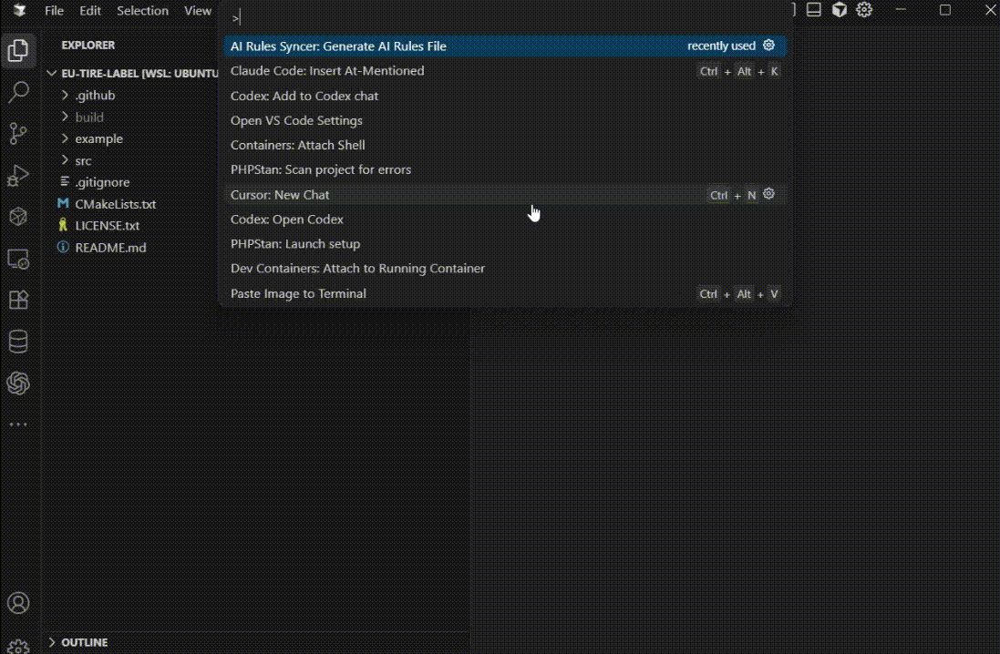

# AI Rules Syncer



A VS Code extension that automatically syncs your AI assistant rules to multiple files when you save your main rules file. Perfect for developers who use multiple AI assistants (Claude, Cursor, Copilot) and want to keep their rules synchronized across different tools and projects.

**⭐ If this extension saves you time and makes your workflow smoother, please consider starring the repository! Your support means the world to us and helps the project grow. ⭐**

## ☕ Support

If this extension helps you, consider supporting the development:

[](https://buymeacoffee.com/doonfrs)

**Your support helps maintain and improve this extension!**

## 🚀 Features

- **Zero Configuration Required** - Works out of the box with sensible defaults
- **Cross-Platform Support** - Windows, macOS, Linux, and WSL/WSL2 compatible
- **Smart File Watching** - Automatically detects when your AI rules file is saved
- **Multi-Target Sync** - Sync to multiple files with different names (CLAUDE.md, cursor.md, etc.)
- **Folder Path Support** - Create files in nested directories (`.cursor/rules.md`, `settings/.cursors/rules.md`)
- **Automatic Directory Creation** - Creates folder structure automatically if it doesn't exist
- **Project-Based Configuration** - Config file travels with your project, no global settings
- **Comment Support** - YAML config with comments to easily enable/disable target files
- **One-Click Setup** - Generate AI rules template and config with a single command
- **Real-Time Sync** - Changes are synced immediately when you save your rules file
- **Flexible File Organization** - Support for any file structure and naming convention
- **Git-Friendly** - Configuration file can be committed and shared with your team

## 📋 Prerequisites

- Visual Studio Code 1.74.0 or higher
- A workspace/project folder (extension works with project-based configuration)

## 🌟 Show Your Support

If you find this extension useful:

- ⭐ **Star this repository** on GitHub
- 📝 **Leave a review** on the VS Code Marketplace
- 🐛 **Report issues** or suggest features
- 💬 **Share** with other developers

## 🎯 Use Cases

### Multi-AI Assistant Workflow
Perfect for developers using multiple AI assistants:
1. Create your main AI rules in `ai-rules.md`
2. Extension automatically syncs to `CLAUDE.md`, `cursor.md`, etc.
3. Each AI tool reads its specific rules file
4. Maintain consistency across all your AI interactions

### Team Collaboration
- Share standardized AI rules across team members
- Commit configuration to version control
- Ensure everyone uses the same AI interaction guidelines
- Easy onboarding for new team members

### Project-Specific Rules
- Different rules for different types of projects
- Frontend vs backend specific guidelines
- Framework-specific AI instructions
- Custom coding standards per project


## ⚙️ Installation

### From VS Code Marketplace
1. Open VS Code
2. Go to Extensions (`Ctrl+Shift+X`)
3. Search for "AI Rules Syncer"
4. Click "Install"

### From VSIX
1. Download the latest `.vsix` file from releases
2. Open VS Code
3. Press `Ctrl+Shift+P` and type "Install from VSIX"
4. Select the downloaded file


## 🔧 Usage

### Quick Start
1. Open Command Palette (`Ctrl+Shift+P`)
2. Type "AI Rules Syncer: Generate AI Rules File"
3. Execute the command to create `ai-rules.md` and `ai-rules.config.yaml`
4. Edit your AI rules in `ai-rules.md`
5. Save the file - your rules are automatically synced to target files!

### Command Palette
- Open Command Palette (`Ctrl+Shift+P`)
- Type "Generate AI Rules File"
- Execute the command to set up your project

### Automatic Syncing
Once set up, the extension works automatically:
- Edit `ai-rules.md` (or your configured source file)
- Save the file (`Ctrl+S`)
- Extension syncs content to all target files defined in your config


## 📁 File Organization

After running the "Generate AI Rules File" command, your project will have:

```text
your-project/
├── ai-rules.md                 # Your main AI rules file
├── ai-rules.config.yaml        # Configuration file
├── CLAUDE.md                   # Synced copy for Claude
├── cursor.md                   # Synced copy for Cursor
└── .cursor/
    └── rules.md                # Synced copy in .cursor folder
```

### Configuration Structure

The `ai-rules.config.yaml` file controls the syncing behavior:

```yaml
# AI Rules Syncer Configuration
sourceFile: ai-rules.md

# Target files to sync to (supports folder paths)
targetFiles:
  - CLAUDE.md                    # Root directory file
  - cursor.md                    # Root directory file
  - .cursor/rules.md             # File in .cursor folder
  # - settings/.cursors/rules.md # Commented out (disabled)
```


## ⚙️ Configuration

The extension uses a project-local YAML configuration file that supports comments.

### Configuration Options

| Setting | Type | Default | Description |
|---------|------|---------|-------------|
| `sourceFile` | string | `ai-rules.md` | The main AI rules file that triggers syncing when saved |
| `targetFiles` | array | `[CLAUDE.md, cursor.md, .cursor/rules.md]` | List of files to sync to (supports folder paths) |

### Editing Configuration

1. Open `ai-rules.config.yaml` in your project root
2. Edit the settings as needed
3. Use `#` to comment out target files you want to disable

### Folder Path Support

The extension supports creating files in nested directories:

```yaml
targetFiles:
  - CLAUDE.md                      # Root directory
  - .cursor/rules.md               # Single folder
  - settings/.cursors/rules.md     # Nested folders
  - docs/ai-guidelines.md          # Any folder structure
```

Folders are created automatically if they don't exist.

### Commenting Target Files

Enable/disable target files by commenting them out:

```yaml
targetFiles:
  - CLAUDE.md                      # Active
  - cursor.md                      # Active
  # - copilot.md                   # Disabled (commented out)
  - .cursor/rules.md               # Active
```

### Custom Source File

Change the source file that triggers syncing:

```yaml
sourceFile: my-custom-rules.md     # Instead of ai-rules.md
targetFiles:
  - CLAUDE.md
  - cursor.md
```

## 🤝 Contributing

Contributions are welcome! Please feel free to submit a Pull Request. For major changes, please open an issue first to discuss what you would like to change.

### Development Setup
1. Clone this repository
2. Run `npm install`
3. Open in VS Code
4. Press `F5` to launch extension development host
5. Test your changes


## 📝 Changelog

### v0.0.1
- Initial release
- Project-based YAML configuration with comment support
- Automatic file syncing on save
- Folder path support with automatic directory creation
- Multi-target file synchronization
- Cross-platform compatibility (Windows, macOS, Linux, WSL/WSL2)
- One-click setup with AI rules template generation
- Git-friendly configuration files
- Real-time sync notifications


## 🐛 Known Issues

- Large files may take a moment to sync to multiple targets
- YAML parsing is basic - complex YAML features not supported
- Configuration changes require saving the rules file to take effect

## 📄 License

This project is licensed under the MIT License - see the [LICENSE](LICENSE) file for details.

---

## 💬 Connect

- 🐙 **GitHub**: [@doonfrs](https://github.com/doonfrs)
- ☕ **Support**: [Buy me a coffee](https://buymeacoffee.com/doonfrs)

**Made with ❤️ for developers using multiple AI assistants**
